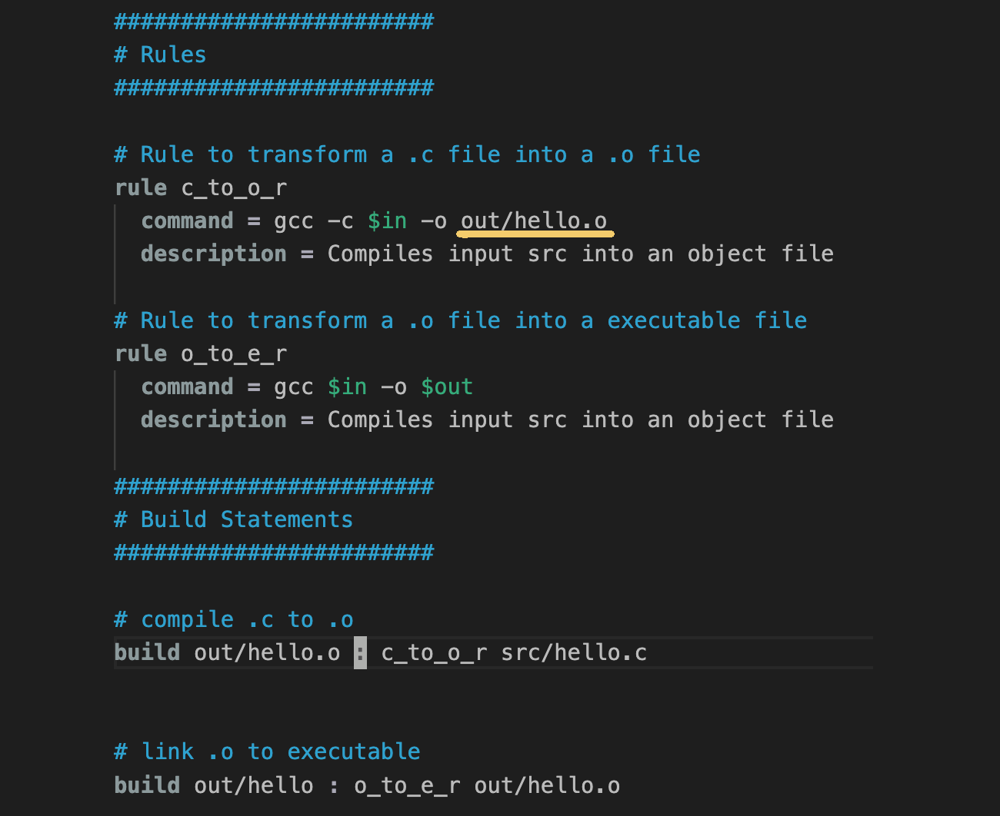
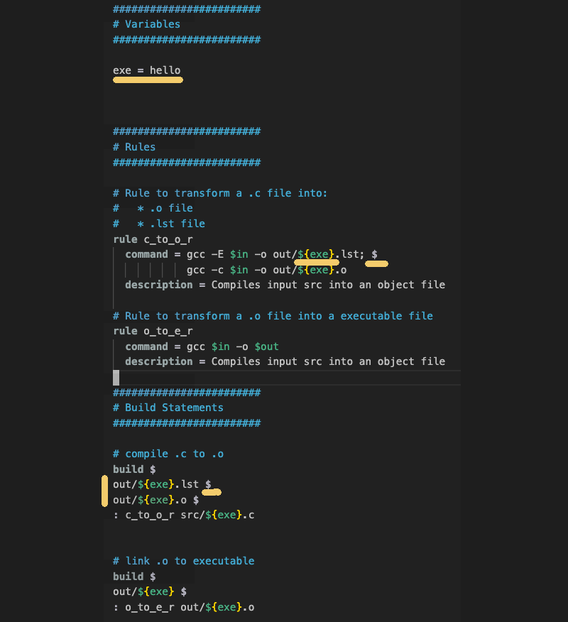

# ninja_testy
Tutorial for Ninja Build

## Medium Article
Used in conjunction with a medium article to provide a tutorial on use of ninja build.

## Ninja Build Overview

Ninja is a build tool similar to Make.  It's meant to be a backend for other build systems.  In other words,
rather than write ninja scripts directly, its meant to have another tool such as CMake or GN generate
ninja build configuration files.   However, it can be used directly.  Not to mention, the project 
includes a script for use in writing your own build frontend tool.

With that said, the purpose of this repo article is to show how to:

* use ninja directly without a front end generator
* use ninja's provided generation script for building ninja config files
* use ninja as a back end for two popular build systems
	- CMake
	- GN

## Ninja File System and Project Setup

This [repo](https://github.com/netskink/ninja_testy) has a project directory with various
samples.  All the sample projects have the same layout with a `build.ninja` file at the top
of the project and three folders containing the source, test code and output directory created
as part of the build process for binaries and executables.  See here.


Note, the outdir is created and maintained by the ninja build process so it is included in the `.gitignore`.

## First Steps

Similar to other build tools, Ninja has commands and receipes for building software.  

A rule statement in Ninja parlance specifies how to transform an input into an output using a command.  

While a build statement in Ninja specifies for a given output(s) what rule is used to transform the required input(s) and what dependencies are required.

Example 1 show a simple `build.ninja` file to make hello_word.c.

[Here](https://github.com/netskink/ninja_testy/blob/main/prj/ex1/build.ninja) is the ninja file with comments.  



Here is how to use ninja to build the sample:

```
$ ninja -v
[1/2] gcc -c src/hello.c -o out/hello.o
[2/2] gcc out/hello.o -o out/hello
```

In this case, the `-v` option is just to make the output more verbose.

Here is how to use ninja to clean the build results:

```
$ ninja -t clean
Cleaning... 2 files.
```

The `-t` specification is for using the clean tool.

Furthermore, note how the rule to build a object file from a source file is explictly named?  That presents a problem.  If you have multiple source files, it requires multiple rules for each source file.  The way to avoid that is with the use of variables.

Variables are already being used with the `$in` and `$out` specifications in this example.  However they are replacements for the variables when the rule is used in conjunction with the build statements.

Also note how the rules have a command and a description specification.  These can be described by listing the various rules in play:

```
$ ninja -t rules
c_to_o_r
o_to_e_r
phony
```

Adding `-d` will print the rule description:

```
$ ninja -t rules -d
c_to_o_r: Compiles input src into an object file
o_to_e_r: Compiles input src into an object file
phony
```

Printing all targets and the rules used is done like so:

```
$ ninja  -t targets all
out/hello.o: c_to_o_r
out/hello: o_to_e_r
```

## Second Steps

Let's introduce the use of variables so we can boilerplate rule usage.  Also, let's use the `$` as a line break so we
can easily identify multiple outputs and multiple commands
in a single rule.

Example 2 is [here](https://github.com/netskink/ninja_testy/blob/main/prj/ex2/build.ninja) and shown below with highlights:



