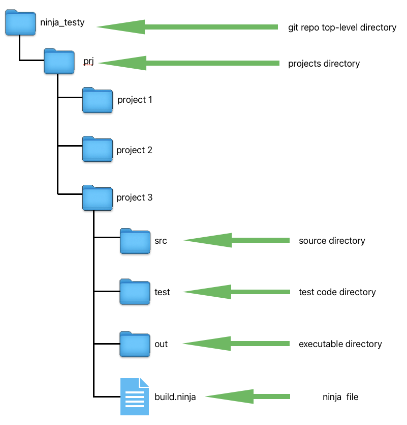

# ninja_testy
Tutorial for Ninja Build

## Medium Article
Used in conjunction with a medium article to provide a tutorial on use of ninja build.

## Ninja Build Overview

Ninja is a build tool similar to Make.  It's meant to be a backend for other build systems.  In other words,
rather than write ninja scripts directly, its meant to have another tool such as CMake or GN generate
ninja build configuration files.   However, it can be used directly.  Not to mention, the project 
includes a script for use in writing your own build frontend tool.

With that said, the purpose of this repo article is to show how to:

* use ninja directly without a front end generator
* use ninja's provided generation script for building ninja config files
* use ninja as a back end for two popular build systems
	- CMake
	- GN

## Ninja File System and Project Setup

This [repo](https://github.com/netskink/ninja_testy) has a project directory with various
samples.  All the sample projects have the same layout with a `build.ninja` file at the top
of the project and three folders containing the source, test code and output directory created
as part of the build process for binaries and executables.  See here.

Note, the outdir is created and maintained by the ninja build process so it is included in the `.gitignore`.

## Usage

Similar to other build tools, Ninja has commands and receipes for building software.  

A rule statement in Ninja parlance specifies how to transform an input into an output using a command.  

While a build statement in Ninja specifies for a given output(s) what rule is used to transform the required input(s) and what dependencies are required.

Example 1 show a simple `build.ninja` file to make hello_word.c.

Here is the ninja file with comments and 

