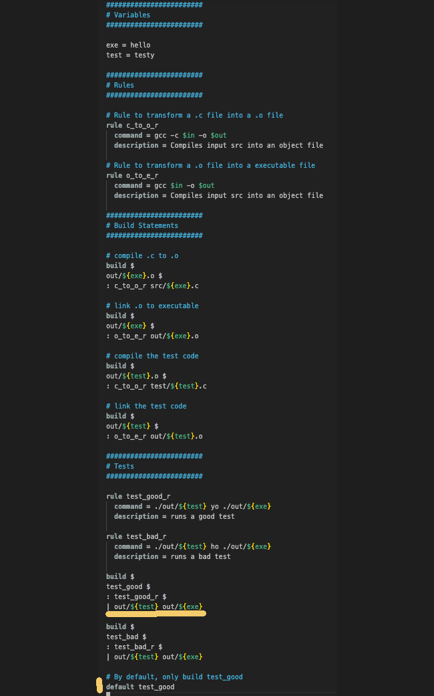
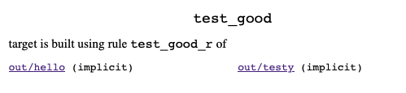

# ninja_testy
Tutorial for Ninja Build

## Medium Article
Used in conjunction with a medium article to provide a tutorial on use of ninja build.

## Ninja Build Overview

Ninja is a build tool similar to Make.  It's meant to be a backend for other build systems.  In other words,
rather than write ninja scripts directly, its meant to have another tool such as CMake or GN generate
ninja build configuration files.   However, it can be used directly.  Not to mention, the project 
includes a script for use in writing your own build frontend tool.

With that said, the purpose of this repo is to show how to:

* use ninja directly without a front end generator
* use ninja's provided generation script for building ninja config files
* use ninja as a back end for two popular build systems
	- CMake
	- GN

## Ninja File System and Project Setup

This [repo](https://github.com/netskink/ninja_testy) has a project directory with various
samples.  All the sample projects have the same layout with a `build.ninja` file at the top
of the project and three folders containing the source, test code and output directory created
as part of the build process for binaries and executables.  See here.


Note, the outdir is created and maintained by the ninja build process so it is included in the `.gitignore`.

## Using Ninja Directly

### First Steps

Similar to other build tools, Ninja has commands and receipes for building software.  

A rule statement in Ninja parlance specifies how to transform an input into an output using a command.  

While a build statement in Ninja specifies for a given output(s) what rule is used to transform the required input(s) and what dependencies are required.

Example 1 show a simple `build.ninja` file to make hello_word.c.

[Here](https://github.com/netskink/ninja_testy/blob/main/prj/ex1/build.ninja) is the ninja file with comments.  


Here is how to use ninja to build the sample:

```
$ ninja -v
[1/2] gcc -c src/hello.c -o out/hello.o
[2/2] gcc out/hello.o -o out/hello
```

In this case, the `-v` option is just to make the output more verbose.

Here is how to use ninja to clean the build results:

```
$ ninja -t clean
Cleaning... 2 files.
```

The `-t` specification is for using the clean tool.  Unlike make
where clean is a target, here it is a tool.

Furthermore, note how the rule to build a object file from a source file is explictly named?  That presents a problem.  If you have multiple source files, it requires multiple rules for each source file.  The way to avoid that is with the use of variables.

Variables are already being used with the `$in` and `$out` specifications in this example.  However they are replacements for the variables when the rule is used in conjunction with the build statements.

Also note how the rules have a command and a description specification.  These can be described by listing the various rules in play:

```
$ ninja -t rules
c_to_o_r
o_to_e_r
phony
```

Adding `-d` will print the rule description:

```
$ ninja -t rules -d
c_to_o_r: Compiles input src into an object file
o_to_e_r: Compiles input src into an object file
phony
```

Printing all targets and the rules used is done like so:

```
$ ninja  -t targets all
out/hello.o: c_to_o_r
out/hello: o_to_e_r
```

### Second Steps

Let's introduce the use of variables so we can boilerplate rule usage.  Also, let's use the `$` as a line break so we
can easily identify multiple outputs and multiple commands
in a single rule.

Example 2 is [here](https://github.com/netskink/ninja_testy/blob/main/prj/ex2/build.ninja) and shown below with highlights:


Note the following:

* the compile step has two outputs, the listing and the object file.
* the rule to perform the compile issues two commands and the `$` to form line breaks
* the build statements are split using `$`
* the variable `exe` is used so that all rules and build statements use substition.
* the usage of `{}` and without to return the value of a variable.


### Third Steps

Let's make one more iteration to show how to add a test, specify
a default target and some more basic usage.

Note, this example does not use a test framework nor is particulary usefull.
Its purpose is more to demo how ninja supports fake outputs.

In this case, the `$in` and `$out` both come from the build statement.  Also, 
this demonstrates a limitation.   There are two rules for the test with explicit
runtime args: "yo" and "ho".  These can not be specified on the build statement,
since there isn't a file with these names.

However, the fake outputs test_good and test_bad targets are acceptable.  In fact,
they can be used by `default` target specification.  Note, the default target 
is all, but in this case this example uses a specific name which is test_good.

Lastly, in terms of syntax, this example shows how to use a dependency.  In this case,
the tests can not be done until both the program under test - hello, and the test
program - testy are both built and in place.

Example 3 is [here](https://github.com/netskink/ninja_testy/blob/main/prj/ex2/build.ninja) and shown below with highlights:



Targets can be explictly executed even though not currently built due to a default omitting them.  
Case in point is shown below:

```
$ ninja -t clean
Cleaning... 4 files.
$ ninja
[5/5] runs a good test
program under test ran ok.
$ ninja test_bad
[1/1] runs a bad test
FAILED: test_bad 
./out/testy ho ./out/hello
program under test did not produce execpted output.
Expected -->ho<--
Got      -->yo<--
ninja: build stopped: subcommand failed.
```


One last usage example is to show how the ninja can provide a web browser to explore the targets, rules and build statements.


```
$ ninja -t browse --port=8000 test_good
```

